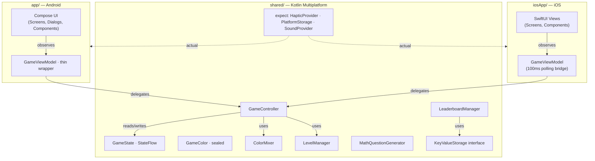
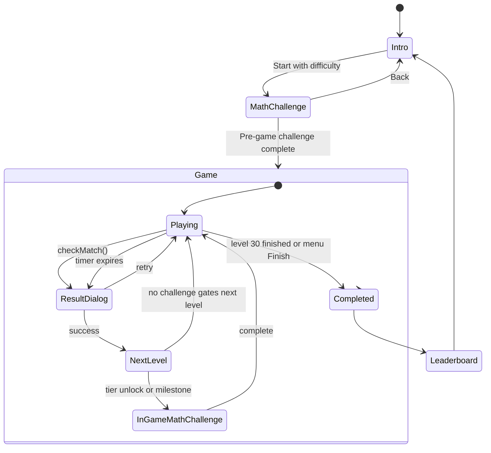

# Architecture

This document describes the technical architecture of ColorMixLab, including module structure, state management, KMP platform abstractions, and notable engineering trade-offs.

## Module graph

## State management

The single source of truth is `GameController.gameState: StateFlow<GameState>` in the shared module. Every game action — adding drops, checking matches, advancing levels, ticking the timer — funnels through `GameController`, which mutates state via `MutableStateFlow.update { }`.

**Why `update {}`** rather than `value = value.copy(...)`: the timer-tick coroutine and UI thread can both invoke mutations concurrently. Direct `value =` assignment is a non-atomic read-modify-write that can lose updates. `update {}` retries on contention via CAS, guaranteeing every mutation sees the latest state.

## KMP platform abstractions

Three platform services use the `expect`/`actual` pattern:

| Abstraction | Android actual | iOS actual |
|---|---|---|
| `HapticProvider` | `Vibrator` / `VibrationEffect` | `UIImpactFeedbackGenerator` |
| `PlatformStorage` | `SharedPreferences` | `NSUserDefaults` |
| `SoundProvider` | `SoundPool` (stubbed) | `AVAudioPlayer` (stubbed) |

`PlatformStorage` also has a thin `KeyValueStorage` interface adapter so `LeaderboardManager` can be unit-tested with an in-memory fake without touching SharedPreferences or NSUserDefaults.

## Game flow

## Engineering trade-offs

### iOS observation: 100ms polling instead of `StateFlow`-as-`AsyncSequence`

Bridging Kotlin `StateFlow` to SwiftUI cleanly requires either [SKIE](https://skie.touchlab.co/) or [KMP-NativeCoroutines](https://github.com/rickclephas/KMP-NativeCoroutines), both of which add significant Gradle plugin complexity and (in SKIE's case) a build-time dependency on Kotlin's compiler internals.

The iOS `GameViewModel` instead reads `gameController.gameState.value` on a `Timer.publish(every: 0.1)` and republishes via `@Published`. Cost: up to 100ms of UI lag, no real-time guarantee. Benefit: zero extra dependencies, works on any KMP version.

For a turn-based color-mixing game where the smallest meaningful interaction is "add a drop," 100ms is well below the perception threshold. If this were a real-time arcade game, the trade-off would be different.

### Atomic state updates

Every state mutation in `GameController` uses `_gameState.update { state -> state.copy(...) }` rather than `_gameState.value = _gameState.value.copy(...)`. The latter is a non-atomic read-modify-write — if the UI thread and the timer-tick coroutine both mutate, one update can be silently dropped. `update {}` uses an internal CAS loop that retries on contention.

### Particle animation: direct `DrawScope`, not Compose recomposition

The end-game celebration renders 50+ particles across a 10-second multi-phase animation. Initial implementations used `animateFloatAsState` per particle and recomposed each frame, which dropped frames on mid-tier devices.

The current implementation in `GameCompletionCelebration.kt` uses a single `Animatable` driving the master clock, with particle positions computed inline inside `Canvas { ... }`'s `DrawScope` from pre-allocated `FloatArray` buffers. Zero per-frame allocations, zero recomposition.

### Math challenge distractors: 6 strategies, not random numbers

`MathQuestionGenerator` produces 8 wrong answers per question. Naive random integers in a plausible range produce easy-to-eliminate options. Real arithmetic mistakes follow patterns: off-by-one factors (`6 × 7` answered as `6 × 8 = 48`), squared factors (`6 × 6 = 36`), nearby multiples, near-misses (correct ± 1 to 5). The generator implements all of these.

Result: a 9-year-old has to actually compute `6 × 7`; they can't just spot the obviously-wrong answer.

### Tier-based color unlocks with random selection

The 30 levels expose 9 base + unlockable colors. Rather than a fixed sequence, `GameColor` defines six tiers (levels 4, 7, 10, 13, 16, 19), each with multiple candidate colors. At game start, `initializeGameColors(seed)` randomly picks one color per tier.

This means two playthroughs at the same difficulty have different palettes. Same level structure, different color discovery — replay value with no extra content.

## Testing

Unit tests live in `app/src/test/` and run via the Android test runner. Coverage spans:

- `GameController` — game flow, scoring, timer, math challenges (25 tests)
- `LeaderboardManager` — CRUD, ranking, time-window queries (14 tests)
- `ColorMixer` — averaging, similarity (15 tests)
- `LevelManager` — target generation, complexity scaling (18 tests)
- `MathQuestionGenerator` — question structure, distractor quality (15 tests)
- `GameState`, `LeaderboardEntry`, `MathChallengeTimer` — defaults, sorting, serialization, configuration (40+ tests)

Run with `./gradlew test`. Coverage report via `./gradlew koverHtmlReport` (output in `build/reports/kover/html/`).

Code quality:
- `./gradlew detekt` — static analysis
- `./gradlew spotlessCheck` — formatting check
- `./gradlew spotlessApply` — auto-fix formatting
