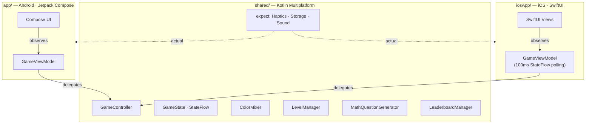

# Color Mix Lab

[](https://github.com/HitOdessit/ColorMixLab/actions/workflows/android.yml)
[](https://github.com/HitOdessit/ColorMixLab/actions/workflows/codeql.yml)
[](https://codecov.io/gh/HitOdessit/ColorMixLab)
[](https://kotlinlang.org)
[](https://swift.org)
[]()
[](LICENSE)

> **A Kotlin Multiplatform color-mixing game shipping to Android and iOS from a single shared codebase — written without a single human-typed line of code.**

30 levels. 15+ unlockable colors organized into 6 random tiers. Math challenges as gating mechanics. Local leaderboard with time-windowed views. Particle-based completion celebration. ~70% of the codebase shared across platforms via KMP. Built end-to-end with [Claude Code](https://docs.anthropic.com/en/docs/claude-code) — including the architecture, KMP migration, iOS port, CI workflows, tests, and this README.

## Project at a glance

| Metric | Value |
|---|---|
| Lines of Kotlin (shared + Android) | 6,585 |
| Lines of Swift (iOS) | 2,007 |
| Source files | 69 (52 Kotlin, 17 Swift) |
| Code shared via KMP | ~70% |
| Unit tests | 100+ across 8 test suites |
| Levels | 30 |
| Unlockable color tiers | 6 |
| Min Android SDK | 24 (Android 7.0+) |
| Target Android SDK | 35 |
| Min iOS | 15.0 |

## Features

- **30 progressive levels** with target recipes growing from 2 colors to 5
- **Math challenges** gating new color tiers (multiplication with pedagogically plausible distractors, not random integers)
- **Three difficulty modes** with timed gameplay on Medium/Hard
- **Local leaderboard** with Today, This Week, This Month, All Time tabs
- **Multi-phase completion celebration** with 50+ particles at 60fps
- **Adaptive layouts** for portrait, landscape, phones, and tablets
- **Haptic feedback** at key interactions and on timer warnings
- **Fully offline** — no network calls, no analytics SDK, no tracking. Verifiable from the manifest.

## Architecture



`GameController` is the single source of truth. Every action — adding a drop, checking a match, ticking the timer — funnels through it and is committed via atomic `StateFlow.update { }`. Both platforms observe the same `StateFlow<GameState>`. See [ARCHITECTURE.md](ARCHITECTURE.md) for the full breakdown.

## Notable engineering decisions

- **Atomic state updates.** Every mutation in `GameController` uses `_gameState.update { state -> state.copy(...) }`, not `_gameState.value = ...copy(...)`. The latter is a non-atomic read-modify-write — the timer-tick coroutine and UI thread can race and lose updates. `update {}` retries via CAS.

- **iOS state observation: 100ms polling, not SKIE.** Bridging Kotlin `StateFlow` to SwiftUI cleanly requires SKIE or KMP-NativeCoroutines, both of which add significant Gradle and compiler-plugin complexity. For a turn-based game, a `Timer.publish(every: 0.1)` polling `gameController.gameState.value` is well below the perception threshold and adds zero dependencies. The trade-off is documented inline.

- **Particle animation: direct `DrawScope`, not Compose recomposition.** The 10-second end-game celebration with 50+ particles dropped frames when each particle had its own `animateFloatAsState`. Current implementation uses a single master `Animatable` clock and computes positions from pre-allocated `FloatArray` buffers inside `Canvas { }`. Zero per-frame allocations.

- **Math distractors: 6 strategies, not random.** Naive random wrong answers are easy to eliminate. `MathQuestionGenerator` produces near-misses, off-by-one factor errors, squared-factor traps, and nearby multiples — patterns that mirror real arithmetic mistakes. A 9-year-old has to actually compute `6 × 7`.

- **Tier-based color unlocks with random selection.** Six unlock tiers; one color per tier is chosen at game start from a candidate pool. Two playthroughs at the same difficulty have different palettes — replay value with no extra content.

## Built entirely with AI

Every line of Kotlin, Swift, Gradle config, GitHub Actions workflow, and documentation in this repo was generated through Claude Code. **No code was hand-written.**

What this proves out:

- A non-trivial cross-platform mobile app (KMP + Compose + SwiftUI) is buildable end-to-end with AI tooling.
- AI handles cross-platform consistency well — game logic stayed in sync across Android and iOS without manual coordination.
- AI-generated code still benefits from a deliberate human-led review pass: dead code removal, thread-safety fixes, and architecture refinement required focused cleanup commits.

Read the full retrospective in [CLAUDE.md](CLAUDE.md). Example prompts you could use to reproduce this project are in [docs/reproduce.md](docs/reproduce.md). The AI's own real-time development notes (54 markdown files) are archived in [docs/dev-notes/](docs/dev-notes/).

## Project structure

```
ColorMixLab/
├── app/                              # Android application
│   └── src/
│       ├── main/java/com/colormixlab/
│       │   ├── MainActivity.kt       # Sealed Screen routing
│       │   ├── game/                 # ViewModel
│       │   ├── ui/                   # Compose screens & dialogs
│       │   │   ├── components/       # MixingBowl, ColorButton, animations
│       │   │   ├── dialogs/          # Menu, Result, Nickname
│       │   │   └── theme/            # Material 3
│       │   └── utils/                # Haptics, color extensions
│       └── test/                     # 100+ unit tests
├── shared/                           # Kotlin Multiplatform shared module
│   └── src/
│       ├── commonMain/
│       │   └── kotlin/com/colormixlab/
│       │       ├── game/             # GameController, GameState, ColorMixer,
│       │       │                     # LevelManager, GameConstants, math/
│       │       ├── model/            # GameColor, LeaderboardEntry, PlatformColor
│       │       ├── data/             # LeaderboardManager
│       │       ├── platform/         # expect: Haptics, Storage, Sound + KeyValueStorage
│       │       └── utils/            # MathChallengeTimer
│       ├── androidMain/              # Android actuals (SharedPreferences, etc.)
│       └── iosMain/                  # iOS actuals (NSUserDefaults, etc.)
├── iosApp/ColorMixLab/               # iOS Xcode project
│   └── ColorMixLab/
│       ├── UI/Screens/
│       ├── UI/Components/
│       └── Utilities/
├── config/detekt/                    # detekt config
├── docs/
│   ├── ARCHITECTURE.md (root)        # Architecture deep-dive
│   ├── reproduce.md                  # Example prompts to rebuild this project
│   ├── assets/                       # Design assets
│   └── dev-notes/                    # Archived AI-generated dev notes
├── gradle/libs.versions.toml         # Version catalog
└── .github/
    ├── workflows/                    # CI: build+test, CodeQL, release
    ├── dependabot.yml
    ├── ISSUE_TEMPLATE/
    └── PULL_REQUEST_TEMPLATE.md
```

## Game mechanics

### Color progression

| Levels | Available colors | Unlocked at |
|--------|-----------------|-------------|
| 1-3    | Red, Blue, Green | Start |
| 4-6    | + 1 from {Yellow, Cyan, Gray} | Level 4 (after math challenge) |
| 7-9    | + 1 from {Orange, Magenta, Coral} | Level 7 (after math challenge) |
| 10-12  | + 1 from {Purple, Lime, Turquoise} | Level 10 (after math challenge) |
| 13-15  | + 1 from {Pink, Teal} | Level 13 (after math challenge) |
| 16-18  | + 1 from tier 5 | Level 16 (after math challenge) |
| 19-30  | + 1 from tier 6 | Level 19 (after math challenge) |

### Difficulty modes

| Mode | Per-level timer | Math timer | Score multiplier |
|------|-----------------|------------|------------------|
| Easy | None | None | 0.75x |
| Medium | 40s | 20s | 1.0x |
| Hard | 20s | 10s | 1.25x |

### Scoring

- Match accuracy gates the level (≥80%); higher accuracy yields proportionally more points (40 → 150 base)
- Difficulty multiplier applied: Easy 0.75x, Medium 1.0x, Hard 1.25x
- Time bonus on Medium/Hard scales linearly with remaining seconds (up to 50 points)
- Wrong math answer: −75 points

## Building

### Prerequisites

- **Android**: Android Studio (2023.1+), JDK 17+, Android SDK 35
- **iOS**: Xcode 15+, macOS

### Android

```bash
./gradlew build              # Build everything
./gradlew test               # Run unit tests
./gradlew installDebug       # Install on connected device
./gradlew detekt             # Static analysis
./gradlew spotlessCheck      # Formatting check
./gradlew spotlessApply      # Auto-fix formatting
./gradlew koverHtmlReport    # Coverage report → build/reports/kover/html/
```

### iOS

1. Build the shared KMP framework:
   ```bash
   ./gradlew :shared:linkDebugFrameworkIosSimulatorArm64
   ```
2. Open `iosApp/ColorMixLab/ColorMixLab.xcodeproj` in Xcode
3. Build and run on simulator or device

## Testing

```bash
./gradlew test
```

Coverage spans the shared game logic:

- **GameController** — game flow, scoring, timer, math challenges (25 tests)
- **LeaderboardManager** — CRUD, ranking edge cases, time-window queries, capacity, corruption recovery (14 tests)
- **ColorMixer** — averaging, similarity, weighting (15 tests)
- **LevelManager** — target generation, complexity scaling, variety (18 tests)
- **MathQuestionGenerator** — question structure, distractor quality, difficulty scaling (15 tests)
- **GameState**, **LeaderboardEntry**, **MathChallengeTimer** — defaults, sorting, serialization, configuration (40+ tests)

## Screenshots

> Coming soon. Run on a Pixel emulator or any iPhone simulator and capture the intro, gameplay, math challenge, and completion celebration.

## FAQ

**Why a color-mixing game?**
Constrained problem with rich UX surface — color science, kid-friendly UX, animation, math pedagogy, persistence, KMP — without being so big that AI generation breaks down. A solid torture test for AI-driven mobile development.

**Why kids 7-11?**
Forces accessibility-first design: large tap targets, immediate feedback, no text-heavy UI, gentle failure states.

**Why KMP and not Flutter / React Native?**
I wanted native UI on both platforms (Compose + SwiftUI) with shared logic, not a shared rendering layer. KMP is the right tool when you care about platform feel and want to leverage each platform's animation primitives.

**Did Claude actually write 100% of the code?**
Yes. I prompted, reviewed, and decided; Claude generated. See [CLAUDE.md](CLAUDE.md) for the retrospective and [docs/reproduce.md](docs/reproduce.md) for example prompts.

**Will you accept PRs?**
Yes — see [CONTRIBUTING.md](CONTRIBUTING.md). Bug fixes and small enhancements welcome. PRs themselves do not need to be AI-generated.

## Try it / Connect

- Star the repo if you want to follow along
- Read [CLAUDE.md](CLAUDE.md) for the AI-development retrospective
- Read [ARCHITECTURE.md](ARCHITECTURE.md) for the architecture deep-dive
- Open an [issue](https://github.com/HitOdessit/ColorMixLab/issues) with feedback or bugs

## License

MIT — see [LICENSE](LICENSE).
