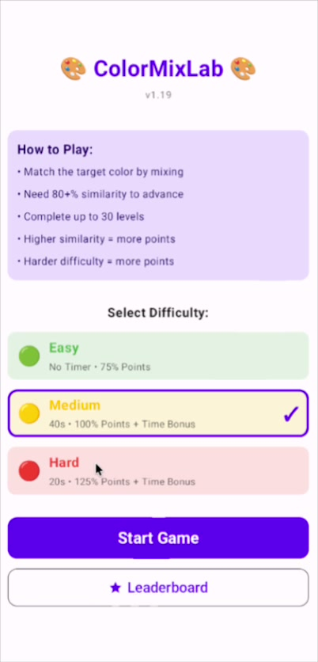
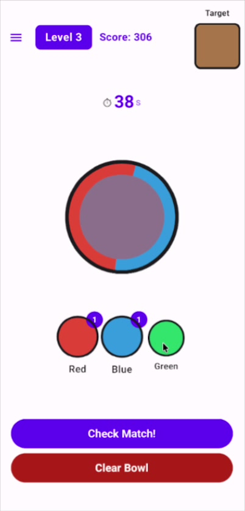
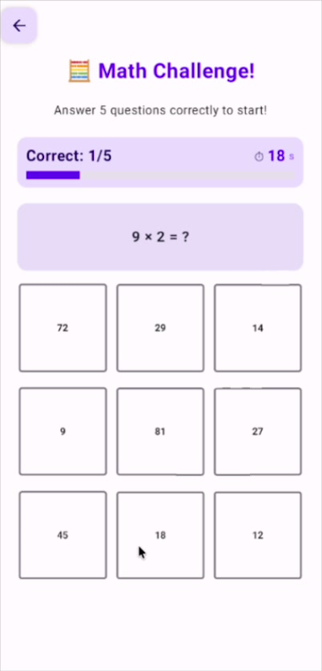
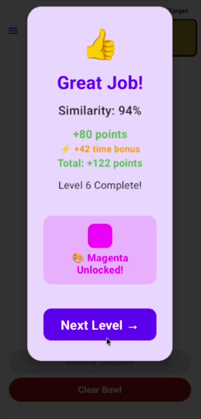
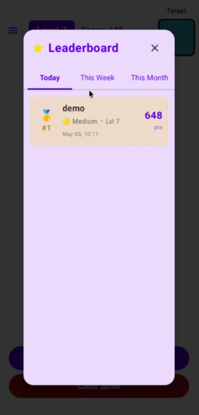
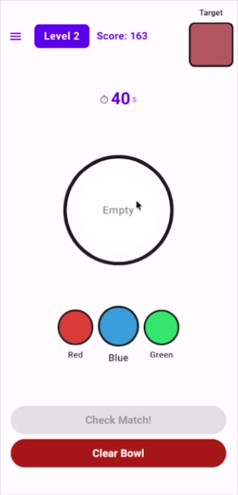
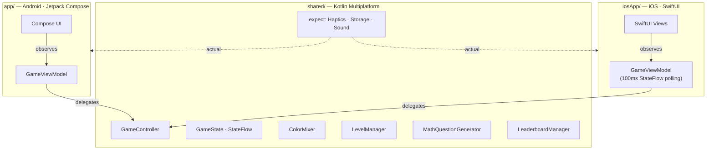

# Color Mix Lab

[](https://github.com/HitOdessit/ColorMixLab/actions/workflows/android.yml)
[](https://github.com/HitOdessit/ColorMixLab/actions/workflows/codeql.yml)
[](https://codecov.io/gh/HitOdessit/ColorMixLab)
[](https://kotlinlang.org)
[](https://swift.org)
[]()
[](LICENSE)

> **A cross-platform Android + iOS game shipped end-to-end without a single hand-typed line of code.**
>
> Kotlin Multiplatform · Jetpack Compose · SwiftUI · CI · 140+ tests · ADRs. All Kotlin, Swift, Gradle, GitHub Actions, and Markdown in this repo was generated by [Cursor](https://cursor.com) and [Claude Code](https://docs.anthropic.com/en/docs/claude-code) under direct human prompting and review. Read the [retrospective](RETROSPECTIVE.md) for the honest version of what worked and what didn't.

**6,585 lines of Kotlin · 2,007 lines of Swift · 140+ tests across 9 suites · 5 ADRs · 30 levels · 0 lines hand-typed.**

## Screenshots

<p align="center">





</p>
<p align="center"><sub>Start · Color mixing · Math challenge · Color unlocked · Leaderboard</sub></p>

## Demo

45-second highlight — color mixing, math gates, tier unlocks, and the end-game celebration:

https://github.com/user-attachments/assets/2edae4f7-a96b-4251-877e-e8045edd4718

For the full 3:33 walkthrough, click the poster:

[](https://github.com/HitOdessit/ColorMixLab/releases/download/demo_v1/colormixlab-demo.mp4)

<sub>23 MB MP4 · also on the [release page](https://github.com/HitOdessit/ColorMixLab/releases/tag/demo_v1)</sub>

## How to read this repo

| If you have…    | Read this |
|------------------|-----------|
| **2 minutes**    | This section + [Why this exists](#why-this-exists) + [Notable engineering decisions](#notable-engineering-decisions) |
| **10 minutes**   | Above + [RETROSPECTIVE.md](RETROSPECTIVE.md) (AI-build story) + [ARCHITECTURE.md](ARCHITECTURE.md) (technical depth) |
| **30 minutes**   | Above + [docs/adr/](docs/adr/) (decision records) + [docs/dev-notes/](docs/dev-notes/) (curated AI-generated build journal) + the source |
| **You're hiring**| Skip to [Notable engineering decisions](#notable-engineering-decisions) and [What this proves out](#what-this-proves-out) |

## Why this exists

The premise: find out whether a non-trivial cross-platform mobile app — KMP, Compose, SwiftUI, CI, tests, release pipeline — is buildable end-to-end with AI today, and where the seams are.

The answer is documented in [RETROSPECTIVE.md](RETROSPECTIVE.md). Short version: yes, with caveats. AI is excellent at boilerplate, cross-platform consistency, and KMP migration mechanics. It needs deliberate human direction on thread safety, scope, and the last 20% of any feature with subjective quality (animation, distractor design).

## Project at a glance

| Metric | Value |
|---|---|
| Lines of Kotlin (total) | 6,585 |
| Lines of Swift (iOS UI) | 2,007 |
| Source files | 69 (52 Kotlin, 17 Swift) |
| Shared module (`commonMain`) | ~1,000 LOC of game logic |
| Unit tests | 140+ across 8 JVM suites + 11 Paparazzi snapshot tests |
| Levels | 30 |
| Unlockable color tiers | 6 |
| Min Android SDK | 24 (Android 7.0+) |
| Target Android SDK | 35 |
| Min iOS | 15.0 |

## Notable engineering decisions

These are the calls that say the most about how the project was built. Each links to a deeper artifact.

- **Atomic state updates ([ADR-0002](docs/adr/0002-atomic-stateflow-updates.md)).** Every mutation in `GameController` is `_gameState.update { state -> state.copy(...) }`, never `_gameState.value = ...copy(...)`. The latter is a non-atomic read-modify-write — the timer-tick coroutine and UI thread can race and silently lose updates. The first AI cut had this bug everywhere; conversion required a deliberate sweep.

- **iOS observation: 100ms polling, not SKIE ([ADR-0003](docs/adr/0003-ios-stateflow-polling-bridge.md)).** Bridging Kotlin `StateFlow` to SwiftUI cleanly requires SKIE or KMP-NativeCoroutines, both of which add significant Gradle and compiler-plugin complexity. For a turn-based game, `Timer.publish(every: 0.1)` polling `gameController.gameState.value` is well below the perception threshold and adds zero dependencies. The trade-off is the documented choice.

- **Particle animation: direct `DrawScope`, not Compose recomposition ([ADR-0004](docs/adr/0004-drawscope-particle-rendering.md)).** The 10-second end-game celebration with 50+ particles dropped frames when each particle had its own `animateFloatAsState`. Current implementation uses a single master `Animatable` clock, computing positions inside `Canvas { }`'s `DrawScope` from pre-allocated `FloatArray` buffers. Zero per-frame allocations, zero recomposition.

- **Math distractors: 6 strategies, not random.** Naive random wrong answers are easy for a kid to eliminate. `MathQuestionGenerator` produces near-misses, off-by-one factor errors, squared-factor traps, nearby multiples — patterns that mirror real arithmetic mistakes. A 9-year-old has to actually compute `6 × 7`. Took several prompt cycles to nail.

- **Tier-based color unlocks with random selection.** Six unlock tiers; one color per tier is chosen at game start from a candidate pool. Two playthroughs at the same difficulty have different palettes — replay value with no extra content.

## What this proves out

- A non-trivial cross-platform mobile app (KMP + Compose + SwiftUI) is buildable end-to-end with AI tooling.
- AI handles cross-platform consistency well — game logic stayed in sync across Android and iOS without manual coordination, which is a real, repeatable benefit of single-AI-author KMP work.
- AI-generated code still benefits from a deliberate human-led review pass: dead code removal, thread-safety fixes, and architecture refinement required focused cleanup commits. That's documented.

The full retrospective is in [RETROSPECTIVE.md](RETROSPECTIVE.md). Example prompts you could use to reproduce parts of this project are in [docs/reproduce.md](docs/reproduce.md). Curated AI-generated dev notes from the build are in [docs/dev-notes/](docs/dev-notes/).

## Architecture



`GameController` is the single source of truth. Every action — adding a drop, checking a match, ticking the timer — funnels through it and is committed via atomic `StateFlow.update { }`. Both platforms observe the same `StateFlow<GameState>`. See [ARCHITECTURE.md](ARCHITECTURE.md) for the full breakdown.

## Features

- **30 progressive levels** with target recipes growing from 2 colors to 5
- **Math challenges** gating new color tiers (multiplication with pedagogically plausible distractors)
- **Three difficulty modes** with timed gameplay on Medium/Hard
- **Local leaderboard** with Today, This Week, This Month, All Time tabs
- **Multi-phase completion celebration** with 50+ particles
- **Adaptive layouts** for portrait, landscape, phones, and (Android) tablets
- **Haptic feedback** at key interactions and on timer warnings
- **Fully offline** — no network calls, no analytics SDK, no tracking. Verifiable from the manifest.

## Project structure

```
ColorMixLab/
├── app/                              # Android application
│   └── src/
│       ├── main/java/com/colormixlab/
│       │   ├── MainActivity.kt       # Sealed Screen routing
│       │   ├── game/                 # ViewModel
│       │   ├── ui/                   # Compose screens & dialogs
│       │   └── utils/                # Haptics, color extensions
│       └── test/                     # 100+ unit tests
├── shared/                           # Kotlin Multiplatform shared module
│   └── src/
│       ├── commonMain/               # GameController, GameState, ColorMixer, ...
│       ├── androidMain/              # Android actuals (SharedPreferences, etc.)
│       └── iosMain/                  # iOS actuals (NSUserDefaults, etc.)
├── iosApp/ColorMixLab/               # iOS Xcode project
├── docs/
│   ├── adr/                          # Architecture Decision Records
│   ├── reproduce.md                  # Example prompts to rebuild this project
│   └── dev-notes/                    # Curated AI-generated build journal
└── .github/workflows/                # CI: build+test, CodeQL, release
```

## Game mechanics

### Color progression

| Levels | Available colors | Unlocked at |
|--------|-----------------|-------------|
| 1-3    | Red, Blue, Green | Start |
| 4-6    | + 1 from {Yellow, Cyan, Gray} | Level 4 (after math challenge) |
| 7-9    | + 1 from {Orange, Magenta, Coral} | Level 7 (after math challenge) |
| 10-12  | + 1 from {Purple, Lime, Turquoise} | Level 10 (after math challenge) |
| 13-15  | + 1 from {Pink, Teal} | Level 13 (after math challenge) |
| 16-18  | + 1 from tier 5 | Level 16 (after math challenge) |
| 19-30  | + 1 from tier 6 | Level 19 (after math challenge) |

### Difficulty modes

| Mode | Per-level timer | Math timer | Score multiplier |
|------|-----------------|------------|------------------|
| Easy | None | None | 0.75x |
| Medium | 40s | 20s | 1.0x |
| Hard | 20s | 10s | 1.25x |

### Scoring

- Match accuracy gates the level (≥80%); higher accuracy yields proportionally more points (40 → 150 base)
- Difficulty multiplier applied: Easy 0.75x, Medium 1.0x, Hard 1.25x
- Time bonus on Medium/Hard scales linearly with remaining seconds (up to 50 points)
- Wrong math answer: −75 points

## Building

### Prerequisites

- **Android**: Android Studio (2023.1+), JDK 17+, Android SDK 35
- **iOS**: Xcode 15+, macOS

### Android

```bash
./gradlew build              # Build everything
./gradlew test               # Run unit tests
./gradlew installDebug       # Install on connected device
./gradlew detekt             # Static analysis
./gradlew spotlessCheck      # Formatting check
./gradlew spotlessApply      # Auto-fix formatting
./gradlew koverHtmlReport    # Coverage report → build/reports/kover/html/
```

### iOS

1. Build the shared KMP framework:
   ```bash
   ./gradlew :shared:linkDebugFrameworkIosSimulatorArm64
   ```
2. Open `iosApp/ColorMixLab/ColorMixLab.xcodeproj` in Xcode
3. Build and run on simulator or device

## Testing

```bash
./gradlew test                          # All unit tests
./gradlew :app:verifyPaparazziDebug     # Compose snapshot tests
./gradlew :app:recordPaparazziDebug     # Re-record snapshot goldens
```

100+ JUnit tests over the shared game logic, run via the Android test runner. Compose snapshot tests via Paparazzi catch visual regressions in `MixingBowl`, `ColorButton`, `TargetColor`, `MathAnswerButton`, and `ResultDialogContent`. See [docs/snapshot-tests.md](docs/snapshot-tests.md).

Suite breakdown:

- **GameController** — game flow, scoring, timer, math challenges (27 tests)
- **LeaderboardManager** — CRUD, ranking edge cases, time-window queries, capacity, corruption recovery (15 tests)
- **ColorMixer** — averaging, similarity, weighting (15 tests)
- **LevelManager** — target generation, complexity scaling, variety (18 tests)
- **MathQuestionGenerator** — question structure, distractor quality, difficulty scaling (17 tests)
- **GameState**, **LeaderboardEntry**, **MathChallengeTimer** — defaults, sorting, serialization, configuration (48 tests)
- **SnapshotTests** — Paparazzi visual regression on `MixingBowl`, `ColorButton`, `TargetColor`, `MathAnswerButton`, `ResultDialogContent` (11 snapshots)

## Roadmap & known gaps

[ROADMAP.md](ROADMAP.md) lays out deliberate v1 scope decisions and acknowledged trade-offs (silent sound effects, no iOS test target, R8 not enabled, etc.). Read it before assuming a missing feature is an oversight.

## FAQ

**Why a color-mixing game?**
Constrained problem with rich UX surface — color science, kid-friendly UX, animation, math pedagogy, persistence, KMP — without being so big that AI generation breaks down. A solid stress test for AI-driven mobile development.

**Why kids 7–11?**
Forces accessibility-first design: large tap targets, immediate feedback, no text-heavy UI, gentle failure states.

**Why KMP and not Flutter / React Native?**
Native UI on both platforms (Compose + SwiftUI) with shared logic, not a shared rendering layer. KMP is the right tool when you care about platform feel and want to leverage each platform's animation primitives.

**Did Claude actually write 100% of the code?**
Yes. I prompted, reviewed, and decided; Claude generated. See [RETROSPECTIVE.md](RETROSPECTIVE.md) for the retrospective and [docs/reproduce.md](docs/reproduce.md) for example prompts.

**Will you accept PRs?**
Yes — see [CONTRIBUTING.md](CONTRIBUTING.md). Bug fixes and small enhancements welcome. PRs themselves do not need to be AI-generated.

## Connect

- Star the repo if you want to follow along
- Read [RETROSPECTIVE.md](RETROSPECTIVE.md) for the AI-development retrospective
- Read [ARCHITECTURE.md](ARCHITECTURE.md) for the architecture deep-dive
- Open an [issue](https://github.com/HitOdessit/ColorMixLab/issues) with feedback or bugs

## License

MIT — see [LICENSE](LICENSE).
